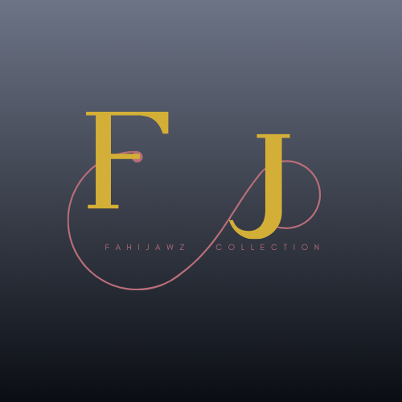

<div align="center">
  

  # ✨ FahiJawz Collection ✨
  
  *Where Tradition Meets Trend.*

  []()
  []()
  []()

  **FahiJawz Collection is a digital storefront celebrating heritage fused with modern style. We offer handcrafted products that bring traditional craftsmanship—like Crochet and Jamdani—into your contemporary lifestyle.**
</div>

---

## 🌟 Key Features

- 🧶 **Traditional Craftsmanship:** High-quality handcrafted items that value and preserve our heritage.
- 🎨 **Modern Aesthetics:** Curated trends for the stylish individual, wrapped in a premium dark-themed UI.
- 📱 **Responsive Design:** A fully responsive, elegant, and interactive browsing experience across all devices.
- 🔒 **Content Protection:** Advanced client-side security measures to protect intellectual property, including right-click disable, keyboard shortcut blocking, and dynamic focus-loss blurring.
- ⚡ **Lightweight Architecture:** Built with pure HTML, CSS, and Vanilla JavaScript for maximum performance and zero dependency overhead.

## 🛠️ Technology Stack

- **Frontend:** HTML5, CSS3 (Variables, Animations, Glassmorphism), Vanilla JavaScript (DOM manipulation, Security logic)
- **Typography:** Google Fonts (`Playfair Display`, `Inter`).

## 🚀 Live Preview

Experience the FahiJawz Collection live:
👉 [**Visit the Official Website**](https://remoteruler.github.io/FahiJawz-Collection/)

## 📁 Repository Structure

```text
FahiJawz-Collection/
├── index.html            # Main landing page with modals and anti-copy protection
├── logo.png              # Official brand logo
├── README.md             # Project documentation
└── LICENSE               # Proprietary legal agreement
```

## ⚖️ Legal Information & Copyright

**Copyright © 2024 FahiJawz Collection. All rights reserved.**

This repository and its entire contents (including all photos, videos, source code, and descriptions) are the exclusive property of **FahiJawz Collection**.

⚠️ **UNAUTHORIZED USE IS STRICTLY PROHIBITED** ⚠️

- You may not copy, clone, or download this repository.
- You may not use any automated tools to scrape our product data or images.
- Commercial or personal reuse of our design assets or brand identity is strictly forbidden.

Please refer to the detailed [**LICENSE**](./LICENSE) file within this repository and the **Privacy & Legal Information** modal on the live page for comprehensive policies regarding Data Privacy, Intellectual Property, and Product Disclaimers.

---

<div align="center">
  <i>Created with ❤️ by the FahiJawz Collection Team</i>
</div>
